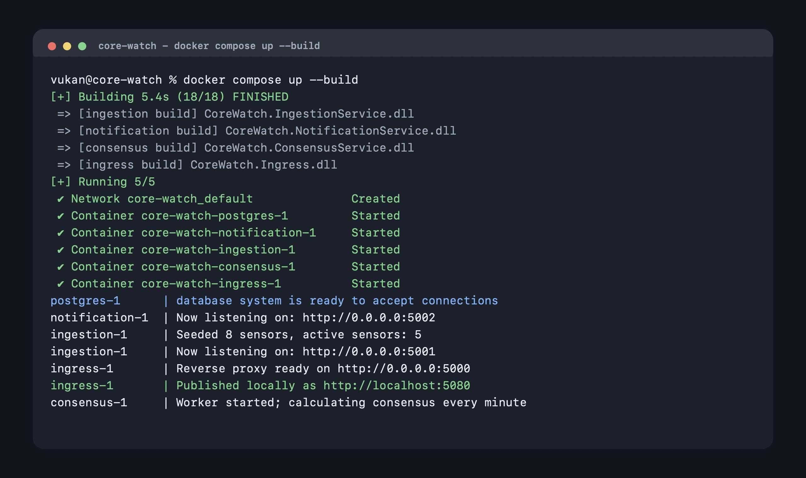
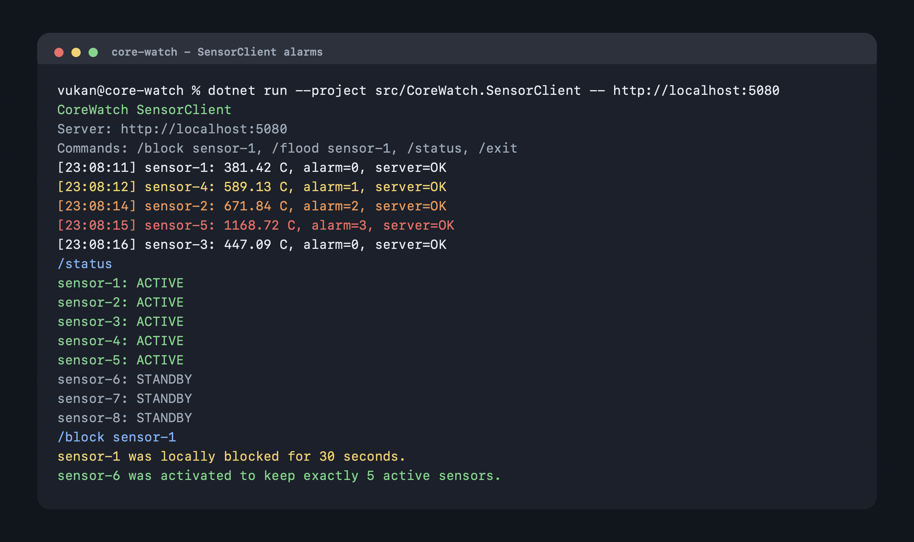
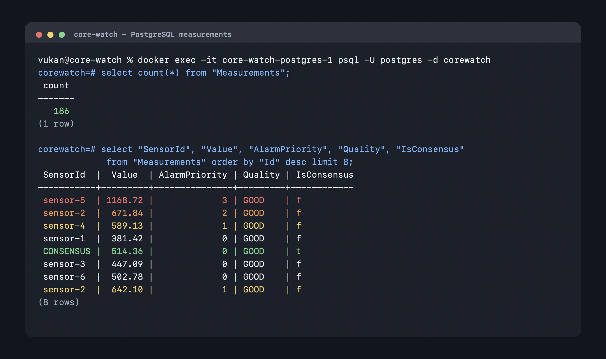
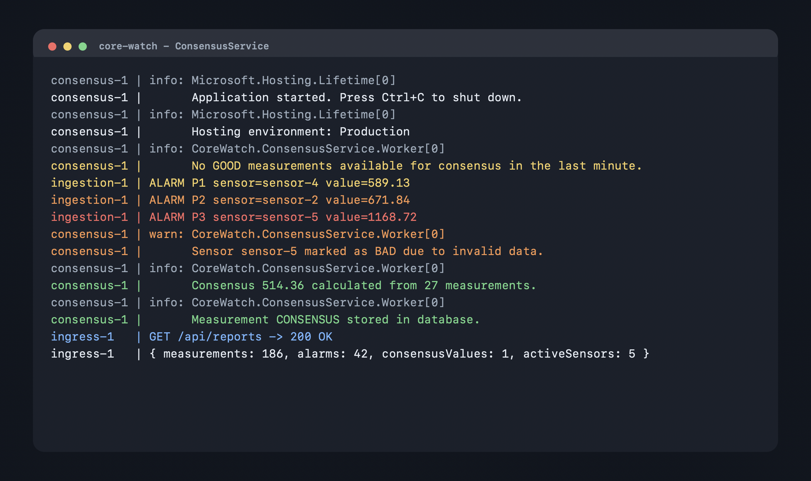

# CoreWatch Screenshots

This directory contains visual evidence for the project submission. The screenshots match the demonstration checklist from `README.md` and the requirements in `SPECIFIKACIJA.md`.

## Included Evidence

- `docker-compose-up.png` shows the Docker Compose runtime with PostgreSQL, ingestion, notification, consensus, and ingress services running.
- `sensor-client-alarms.png` shows the sensor simulator, colored alarm priorities, `/status`, and temporary blocking behavior.
- `database-measurements.png` shows persisted measurements, alarm priorities, and a consensus measurement in PostgreSQL.
- `consensus-service.png` shows the consensus worker logs, invalid data handling, and consensus output.

## Docker Compose Runtime

## SensorClient Alarms And Failover

## PostgreSQL Measurements

## Consensus Worker

